<picture>
  <source media="(max-width: 600px)" srcset="assets/hero-mobile.svg" />
  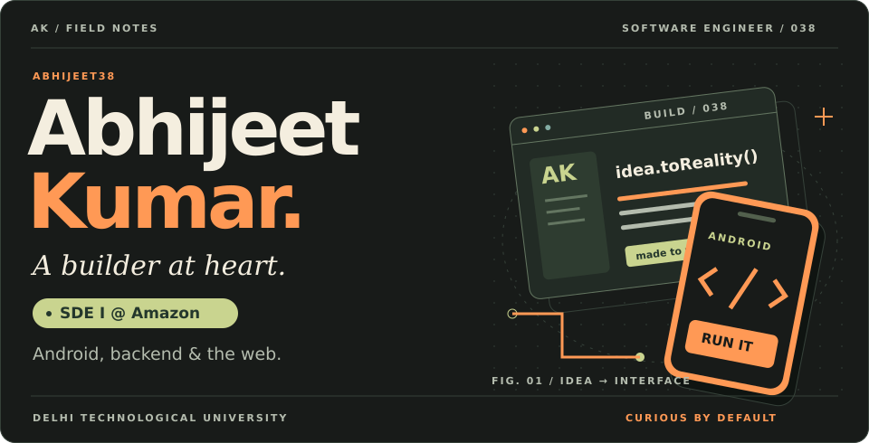
</picture>

  
  <a href="mailto:abhijeet5000kumar@gmail.com">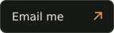</a>

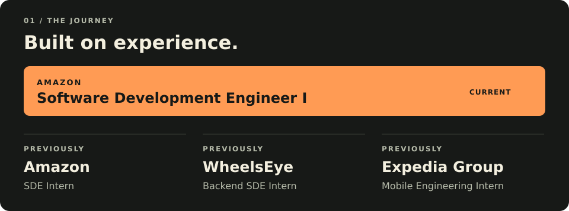
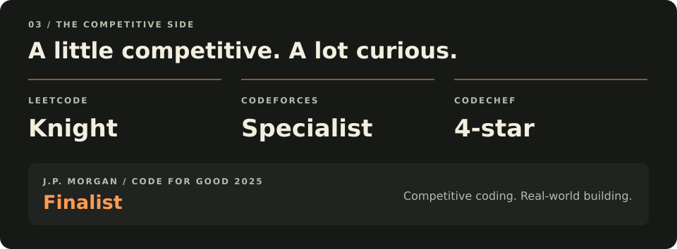

  <a href="https://leetcode.com/u/abhijeet5000kumar/">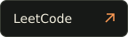</a>
  <a href="https://codeforces.com/profile/abhijeet5000kumar">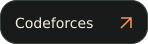</a>
  <a href="https://www.codechef.com/users/abhijeet68">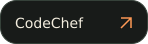</a>

<picture>
  <source media="(max-width: 600px)" srcset="assets/toolkit-mobile.svg" />
  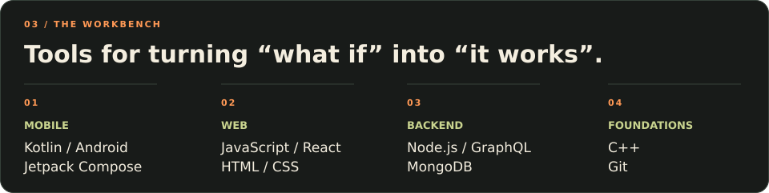
</picture>

 

<picture>
  <source media="(max-width: 600px)" srcset="assets/stats-heading-mobile.svg" />
  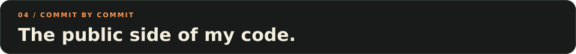
</picture>

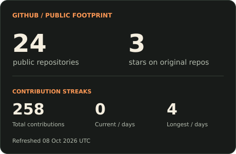
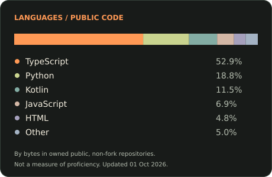

<picture>
  <source media="(max-width: 600px)" srcset="assets/footer-mobile.svg" />
  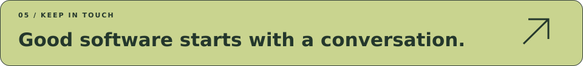
</picture>

  
  
  <a href="https://www.instagram.com/abhijeet_90_8/">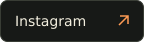</a>

